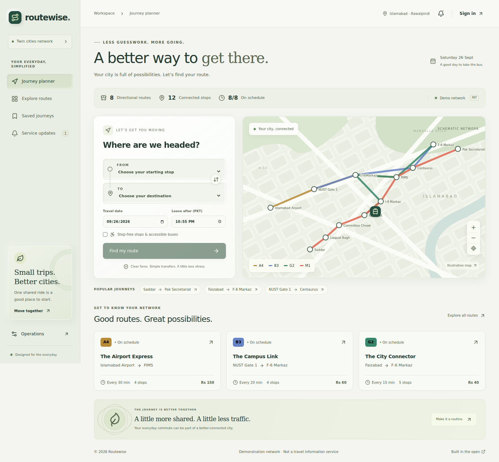
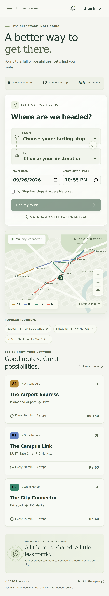

# Bus-Route-System

# Routewise — Bus Route Planning & Network Operations

A full-stack bus journey planner for an illustrative Islamabad–Rawalpindi transport network. Find direct and one-transfer journeys, compare scheduled arrivals and fares, save frequent trips, and manage routes through an administrator dashboard.

Built with React, TypeScript, Fastify, and PostgreSQL.

> Portfolio demonstration: routes, fares, and schedules are sample data, not official transport information. Arrival times are timetable-based, not live predictions.

## Screenshots

### Desktop



### Mobile



## Features

### Journey planning

- Search by origin, destination, date, and departure time.
- Find direct journeys and journeys with one transfer.
- Compare arrival times, transfer counts, and total fares.
- Filter for accessible services.
- Explore routes, stops, service hours, and frequencies.
- View service notices and a schematic network map.

### User accounts

- Register, sign in, and sign out.
- Save up to 50 unique origin–destination pairs.
- Reopen or remove saved journeys.

### Network administration

- Create and edit directional routes and stop sequences.
- Configure fares, frequencies, operating days, and service hours.
- Update route status and accessibility.
- Add stops and publish or remove service notices.
- Review network statistics and recent audit events.
- Detect conflicting route edits through version checks.

### Interface

- Responsive desktop and mobile layouts.
- Glassmorphism-inspired panels and soft, neumorphism-inspired controls.
- Keyboard navigation, visible focus states, and reduced-motion support.
- Loading, empty, and error states.

## Technology Stack

| Area                | Technology                    |
| ------------------- | ----------------------------- |
| Frontend            | React 19, TypeScript, Vite    |
| Navigation          | React Router                  |
| Server state        | TanStack Query                |
| Backend             | Node.js 24, Fastify           |
| Validation          | Zod                           |
| Production database | PostgreSQL                    |
| Local database      | PGlite                        |
| Browser testing     | Playwright, axe               |
| Automation          | GitHub Actions                |
| Deployment          | Docker, Docker Compose, Caddy |

## Getting Started

### Requirements

- Node.js 24
- npm
- Git

A separate PostgreSQL installation is not required for local development. The application uses PGlite locally.

### Installation

```bash
git clone https://github.com/minion-cmyk123/Bus-Route-System.git
cd Bus-Route-System
npm ci
npm run dev
```

Open http://localhost:5173.

The development API runs on http://localhost:3001. Local database files are stored in `.data/transit`.

Keep the terminal running while using the application. Press `Ctrl+C` to stop it.

### Administrator access

There are no default administrator credentials.

Provision an administrator using the `admin:create` script. It accepts JSON through standard input:

```json
{
  "name": "Your Name",
  "email": "you@example.com",
  "password": "replace-with-a-long-unique-password"
}
```

Save the JSON in a temporary file outside the repository.

When using local PGlite, stop the application before running database management commands.

Initialize the database if necessary:

```bash
npm run db:migrate
```

In Command Prompt or Bash:

```bash
npm run admin:create < /path/to/admin.json
```

In PowerShell:

```powershell
Get-Content "C:\path\to\admin.json" -Raw | npm run admin:create
```

Replace the example path with your actual file location. Delete the temporary credentials file after creating the administrator, then restart the application.

## Available Commands

| Command                | Purpose                                                      |
| ---------------------- | ------------------------------------------------------------ |
| `npm run dev`          | Start the frontend and API in development                    |
| `npm run check`        | Run formatting checks, type checks, backend tests, and build |
| `npm test`             | Run backend tests                                            |
| `npm run typecheck`    | Check TypeScript types                                       |
| `npm run format`       | Format project files                                         |
| `npm run build`        | Build the frontend and backend                               |
| `npm start`            | Start the compiled application                               |
| `npm run test:e2e`     | Run browser tests                                            |
| `npm run db:migrate`   | Apply database migrations                                    |
| `npm run db:seed`      | Load the sample network                                      |
| `npm run admin:create` | Provision an administrator                                   |

Before running browser tests for the first time:

```bash
npx playwright install
npm run build
npm run test:e2e
```

## Architecture

The React frontend communicates with a Fastify API. The API handles authentication, journey planning, validation, and database operations.

Development uses embedded PGlite storage. Production uses PostgreSQL. The compiled backend serves the built frontend for a single-origin deployment.

```text
client/       React interface and components
server/       API, authentication, journey planning, and database code
shared/       Shared TypeScript types
e2e/          Browser tests
scripts/      Administration and test utilities
docs/         Architecture, API, deployment, and verification guides
```

## Journey Planning

The planner evaluates directional routes using service days, departure windows, stop offsets, and repeating frequencies.

It supports:

- Direct journeys and a maximum of one transfer.
- A minimum five-minute transfer window.
- Accessibility filtering.
- Exclusion of suspended routes.
- Up to eight results ordered by arrival time, transfers, and fare.

Service times use the `Asia/Karachi` timezone.

## Security and Reliability

- Salted scrypt password hashing.
- Database-backed sessions with hashed session tokens.
- HttpOnly cookies and secure cookie settings in production.
- Request-origin checks for mutations.
- Login throttling and API rate limiting.
- Strict request validation and parameterized SQL.
- Database constraints and transactional route updates.
- Version checks to prevent stale route edits.
- Administrative audit records.
- Health and readiness endpoints.

These controls provide a foundation for deployment; they do not constitute an independent security certification.

## Testing and CI

The project includes backend tests, browser tests, and automated accessibility checks.

GitHub Actions runs formatting and type checks, backend tests, a production build, PostgreSQL integration tests, dependency auditing, browser tests, and a Docker image build.

See [verification notes](docs/VERIFICATION.md) for recorded results and verification limits.

## Deployment

Production deployment requires:

- A Node.js application service or Docker environment.
- A PostgreSQL database.
- An HTTPS application origin.
- Database migrations and administrator provisioning.

Docker and reverse-proxy configuration are included.

See the [deployment guide](docs/DEPLOYMENT.md) for configuration and deployment instructions.

## Current Limitations

- The included transport network is illustrative.
- The map is schematic and does not provide geographic navigation.
- No live GPS tracking or real-time arrival predictions.
- No ticket booking or payment processing.
- Journeys support at most one transfer.
- No overnight services or holiday-specific timetable exceptions.
- No email verification, password recovery, or MFA.
- Large-network performance and production capacity require further testing.

## Documentation

- [Architecture](docs/ARCHITECTURE.md)
- [API](docs/API.md)
- [Deployment](docs/DEPLOYMENT.md)
- [Verification](docs/VERIFICATION.md)
- [GitHub setup](docs/GITHUB-SETUP.md)
- [Contributing](CONTRIBUTING.md)
- [Security](SECURITY.md)

## License

This project is licensed under the MIT License. See [LICENSE](LICENSE).
