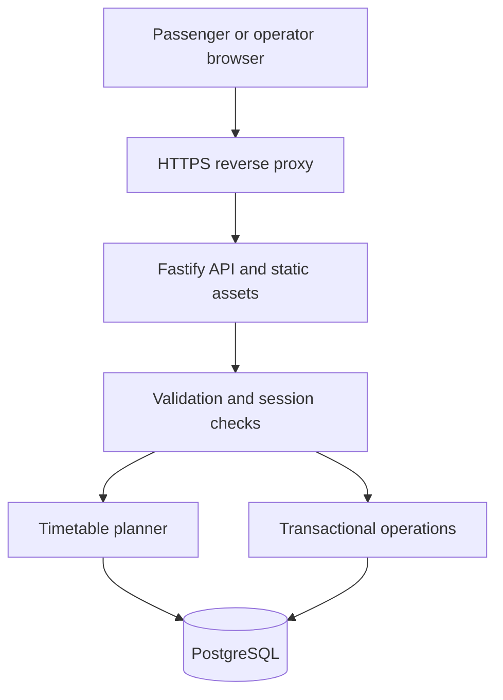

# Architecture

Routewise keeps a single same-origin application boundary: the production Fastify process serves the built React assets and `/api` routes. Development uses Vite’s `/api` proxy. No authentication tokens are stored in browser local storage.

## Database

- `stops`: coordinates, locality and step-free access.
- `routes`: directional line metadata, service window, frequency, days and edit version.
- `route_stops`: ordered stops with increasing travel offsets. Foreign keys prevent dangling stops.
- `users`: unique normalized email, name, password hash and server-assigned role.
- `sessions`: SHA-256 digests of random 256-bit bearer tokens, server expiry, user reference.
- `auth_attempts`: expiring per-email and per-IP counters shared across replicas.
- `saved_journeys`: private origin/destination pairs with unique per-user constraints.
- `alerts`: scoped or network-wide notices with automatic public expiry filtering.
- `audit_logs`: actor, action, entity and timestamp, written in the same transaction as each admin change.
- `schema_migrations`: ordered migration ledger; exclusive table lock serializes migration runners.

PGlite runs the same PostgreSQL SQL in development and isolated tests. The `pg` adapter uses a bounded connection pool in production. No automatic production migration or seed runs in API startup: a release job migrates before the app starts.

## Timetable algorithm

Schedules describe first-stop departures. For a downstream stop, the planner adds its travel offset, then rounds up to the next frequency interval. It rejects departures after the last first-stop service and arrivals beyond the service day.

The planner enumerates direct paths and shared-stop transfers, requiring at least five minutes to change buses. It excludes suspended routes, inactive weekdays, and (when requested) inaccessible buses and boarding/alighting stops. Results are ranked by arrival time, then transfers, then fare. The earliest option for each route combination is kept, up to eight results.

Service times are integer minutes, and service dates determine weekdays independently of the host machine’s timezone. All UI times are in Pakistan time. A delayed route remains searchable, but the UI warns that its scheduled times may vary; no guessed delay is added.

This is intentionally a bounded city-scale planner, not a GTFS/RAPTOR implementation. Enumerating route pairs and transfer stops is not appropriate for nationwide networks. Partitioning by region, indexing stop-to-route membership, caching validated catalogues, and replacing routing with RAPTOR/CSA are expansion paths.

## Concurrency and failure handling

- Route updates lock the row and require a version. A stale editor receives HTTP 409.
- Route metadata, stop sequence and audit entries commit atomically. Invalid foreign keys roll back all changes.
- Saved journeys are capped at 50 per user under a user-row lock, and deduplicated in the database.
- API errors have a consistent envelope with request IDs. Internal errors are logged and not exposed.
- The client distinguishes loading, empty, success and error states; network errors never generate fallback routes.
- Session and authentication state live in PostgreSQL, so application replicas do not require sticky sessions.

## Security decisions

Opaque session tokens use HttpOnly, SameSite=Lax cookies, and Secure plus `__Host-` in production. Tokens are hashed in the database and rotated on sign-in. Passwords use Node’s salted scrypt. Production refuses embedded storage or an HTTP application origin.

Mutations require a custom request header, check the configured origin if present, and reject cross-site Fetch Metadata. There is no permissive CORS endpoint. Authorization is enforced in the API, not merely by hiding controls. Zod strict objects reject privilege fields on registration, SQL values are parameterized, and React escapes user text.

The same-origin CSP permits only local scripts, fonts and images (plus image data URLs); inline styles are allowed for route colours. No third-party fonts or map scripts are required.

Authentication throttling uses shared database counters; the broader per-process rate limiter is a backstop. Configure shared proxy limits for a distributed deployment. Review the trusted proxy chain before enabling `TRUST_PROXY`; the supplied production topology exposes only Caddy.
